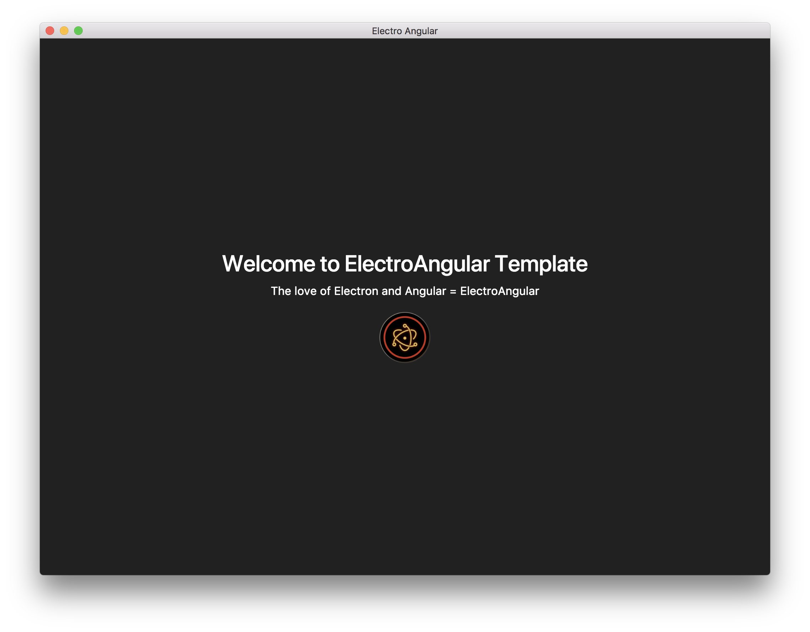

# Introduction

The love of Electron and Angular = ElectroAngular.

ElectroAngular is an starter application project template or a boilerplate which helps you to build base applications fast and efficient.



## Features

ElectroAngular ships with the following

- [Bootstrap 4](https://getbootstrap.com/)
- [ng-bootstrap](https://ng-bootstrap.github.io/)
- [ngx-electron](https://github.com/ThorstenHans/ngx-electron)
- [electron](https://electronjs.org/)
- [Angular 5](https://angular.io)
- [Sass](https://sass-lang.com/)


## Requirements

- [Angular CLI](https://cli.angular.io/)
- [node](https://nodejs.org/en/)
- [npm](https://www.npmjs.com/)

## Getting Started

```bash
    $   git clone https://github.com/syntaxcoder/electroangular.git
    $   cd ElectronAngular
    $   npm install
    $   npm run electron
    $   npm run prod (production release)
```

## Testing

The support for writing unit tests is yet to be implmented. This will be shipped in the next version

## Contribution

If your having any issues, please log/report the bug in the issues section and I will try to solve the bug as soon as I can.


## Thank you
